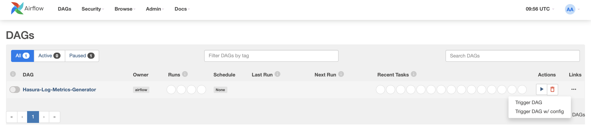
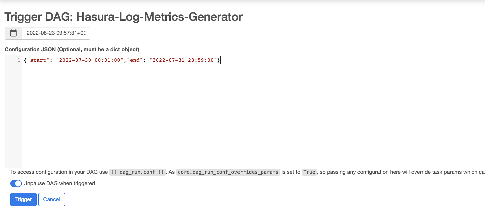
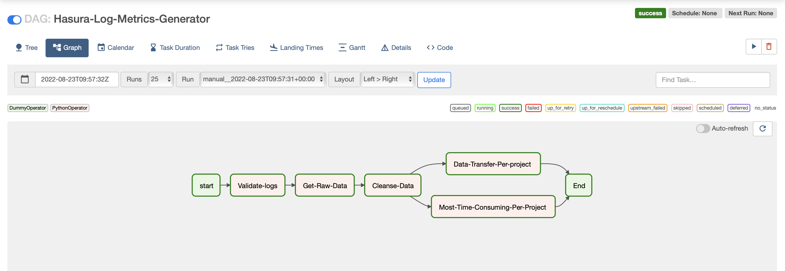
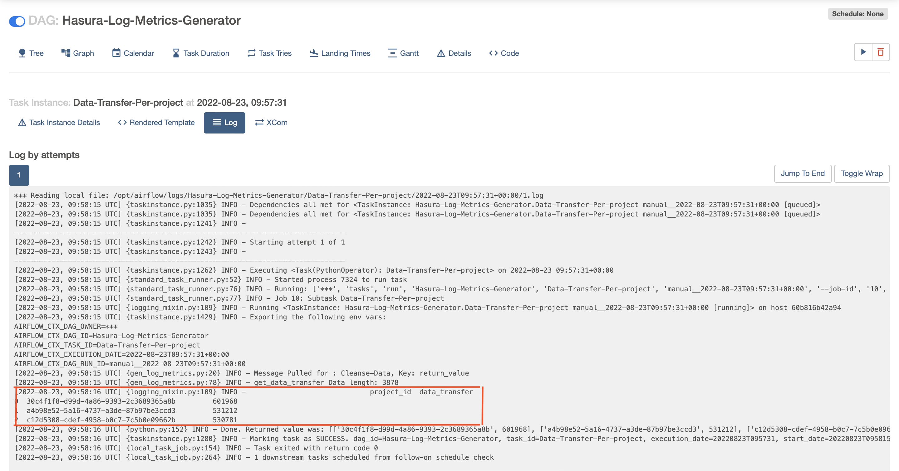
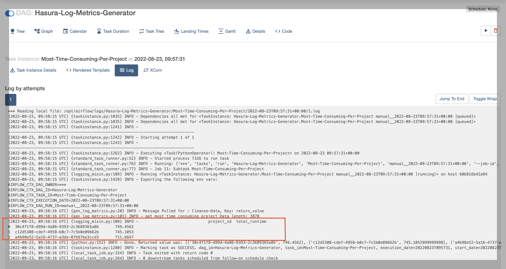

# **Hasura**

### Pipeline Design Solution & compromises from Scalibility point of View

1. ##### Source:
    1. For testing and building pipeline, CSV file format is our source file,
    2. For Scalibility, if there is a case of 100x the volume requests or even more,
       we can push/consume data from kafka.
2. ##### Validate:
    1. To validate the expected file format (i.e CSV).

3. ##### Raw Data:
    1. Storing the raw logs is best practice, that it will help debugging the issue in case of pipeline failure.
    2. For Scalibility and best practice, Consume the raw data from Kafka and store raw logs in AWS S3 or any other data
       lake and data partition by date.
4. ##### Transform/Clean Data:
    1. Since we are getting the unstructured data, it need to be cleansed before actually make insight out of it.
    2. For Scalibility, Use Apache Spark Streaming to cleanse the stream/batch data using custom UDF's on
       specific columns and then store data in data lake in json format and partition by date.
5. ##### Parellel-Generate-Metrics - (data transfer & most time consuming queries):
    1. Pandas sql used to generate the metrics.
    2. For Scalibility, Use Apache Spark sql to transform the data by writing sql query, and store the insights in data
       warehouse.

   You can see the output of these metrics from the airflow operator logs.
    1. Insight - Total Data transfer per project:
       returns dataframe - list of projects corresponding total data transfer (project_id,
       total_data_transfer_per_project)
    2. Insight - Most time consuming project:
       returns dataframe- list of projects corresponding total runtime (project_id, total_runtime_per_project)

### Run Unit Test

* Run `cd hasura/`
* Run `python3 -m venv venv`
* Run `source venv/bin/activate`
* Run `python3 -m pip install --upgrade pip`
* Run `pip install -r requirements.txt`
* Run `python -m unittest tests.log_metrics`
* _If you see something like this:_ Ran 5 tests in ..s OK
* _Then proceed with next step, which is running data pipeline in airflow._

### Prerequisites

* Install [Docker](https://docs.docker.com/desktop/mac/install/)

### Run Airflow (local)

* `sh airflow_on.sh`
* `http://0.0.0.0:8080`
    * username: airflow
    * password: airflow

### Run Dag

* Run dag with config:
    1. Enable the dag: _Hasura-Log-Metrics-Generator_
    2. Trigger dag w/config:
       

    3. Copy this dict: `{"start": "2022-07-30 00:01:00","end": "2022-07-31 23:59:00"}` and paste in the box, as show in
       the picture below and submit trigger button.
       
    4. Dag is triggered with the time window mention above in the dict and it will generate the metrics according to the
       requirements mentioned.

### To See Log output

1. Click on dag: _Hasura-Log-Metrics-Generator_
2. Click on graph view, as mentioed below:
   
3. Go to task: _Data-Transfer-Per-project_ and click logs, you will see metrics in the log output, as mentioned below:
   
4. Go to task: _Most-Time-Consuming-Per-Project_ and click logs, you will metrics in the log output, as mentioned below:
   

_If you these log outputs, you successfuly ran the dag :)_

### To Turn off Airflow

* `sh airflow_off.sh`
